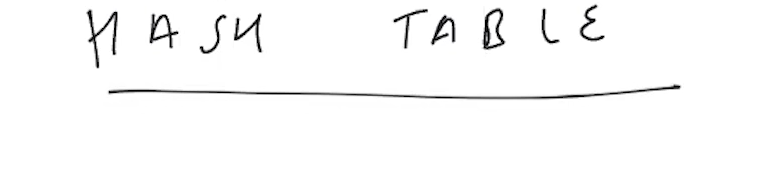
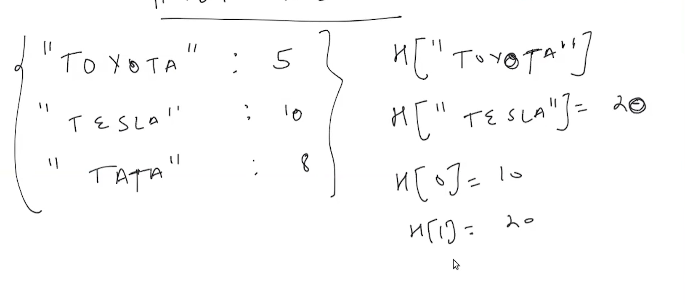
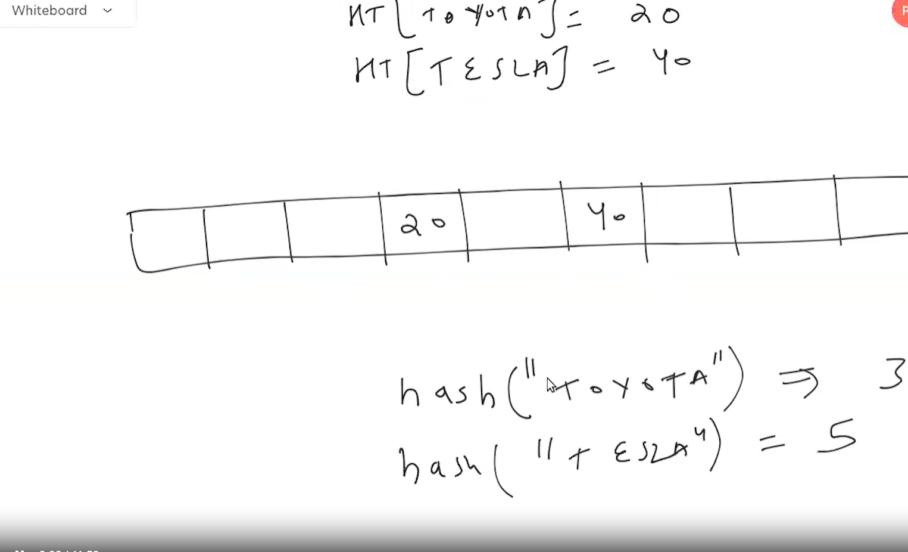

# HASH TABLE DSA

| NO. | questions                                                                                                                                                              |
| --- | ------------------------------------------------------------------------------------------------------------------------------------------------------------------------------------------------------------------------------------------------|
|     | **type of questions**                                                                                                                                                   |
|  1  |[ What-is Hash Table](#)                                                                                                                                                 |
|  2  |[How-is-hash-table-implemented](#)                                                                                                                                       |
|  3  |[Types-of-hash-table](#)                                                                                                                                                 |
|  4  |[Advantage-of-hash-table](#)                                                                                                                                             |
|  5  |[Hash-table-usage](#)                                                                                                                                                    |

|  1. |[ What-is Hash Table](#)

# 1. Hash table

 HASH TABLE and it usages familiar to Arrays  
 

# 1.1 Hash table

|  2. |[How-is-hash-table-implemented](#)

# 2. Hash table implemented

